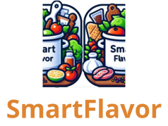

# SmartFlavor

<div style="display: flex; width: 100%; justify-content: center">
    
</div>

## Participantes

- Fabrizzio Andrés Mura Lavarello
- Joaquin Eduardo Tapia Mercado
- Carlos Da Silva Villalobos
- Matías Hernan Bugueño Bugueño

## Guía de ejecución

Para poder hacer ejecución de esta aplicación web, lo primero que se debe hacer es descargar el repositorio como archivo local, esto se puede llevar a cabo ejecutando el siguiente comando desde la terminal.

```sh
git clone https://github.com/The-Insanes/SmartFlavor.git
```

Una vez teniendo el repositorio clonado pasaremos a la instalación de dependencias del backend y del frontend.

### Frontend

Para llevar a cabo la instalación del fontend, lo primero que debe hacer es movernos en la terminal al directorio "SmartFlavor" dentro del repositorio. Una vez dentro deberá ejecutar los siguientes comandos para descargar todas las dependencias del proyecto, armarlo, y exportarlo para ser ejecutado por android studio o Xcode para Iphone.

1) Instalación de dependencias
```sh
npm install
```
2) Armar proyecto
```sh
npm build
```

3) Exportar proyecto a android studio
```sh
npx cap add android
```

4) Exportar proyecto a Xcode
```sh
npx cap add ios
```

Una vez el proyecto se encuentra construido y exportado para cualquiera de los 2 IDE's, a estos se les podrá generar una apk donde se podrá ejecutar la aplicación, esto es **importante** ya que al ser ejecutado como una página web, el uso de componentes de celular puede dar problemas con la ejecución.

### Backend

Para el uso del backend lo primero que deberá hacer será dirigirse desde la terminal al directorio backend que se encuentra dentro del repositorio, una vez dentro deberá ejecutar el siguiente comando para descargar las dependencias para la ejecución de la API y el modelo de red neuronal para la predicción de recetas.

1) Descargar entorno virtual
```sh
py -m venv .venv
```

2) Activar entorno virtual
* Windows
```sh
.venv/Scripts/activate
```

*  Mac o Linux
```sh
source .venv/bin/activate
```

3) Instalar dependencias
```sh
pip install requirements.txt
```

Una vez tenemos las dependencias instaladas podemos proceder a activar el servidor de la API con el siguiente comando:

```sh
py api.py
```

Con todo esto la API deberá estar funcionando en perfectas condiciones y la aplicación web debería estar ejecutando en su celular 😁.

¡Disfrute de SmartFlavor!